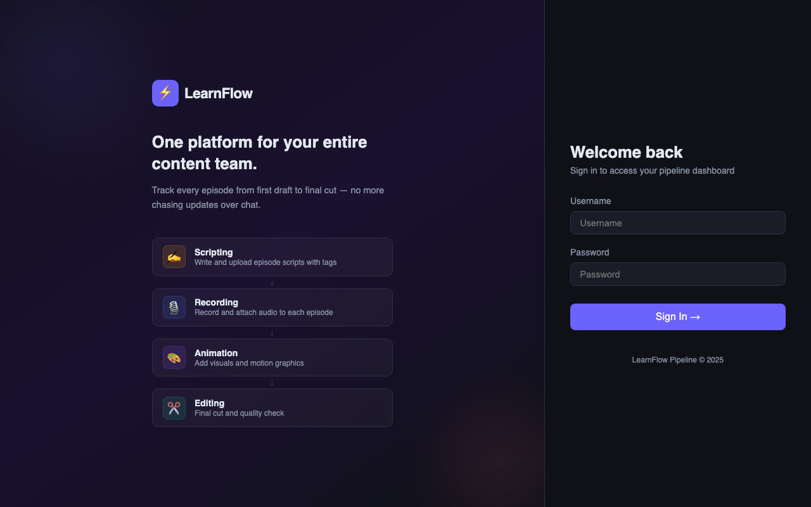
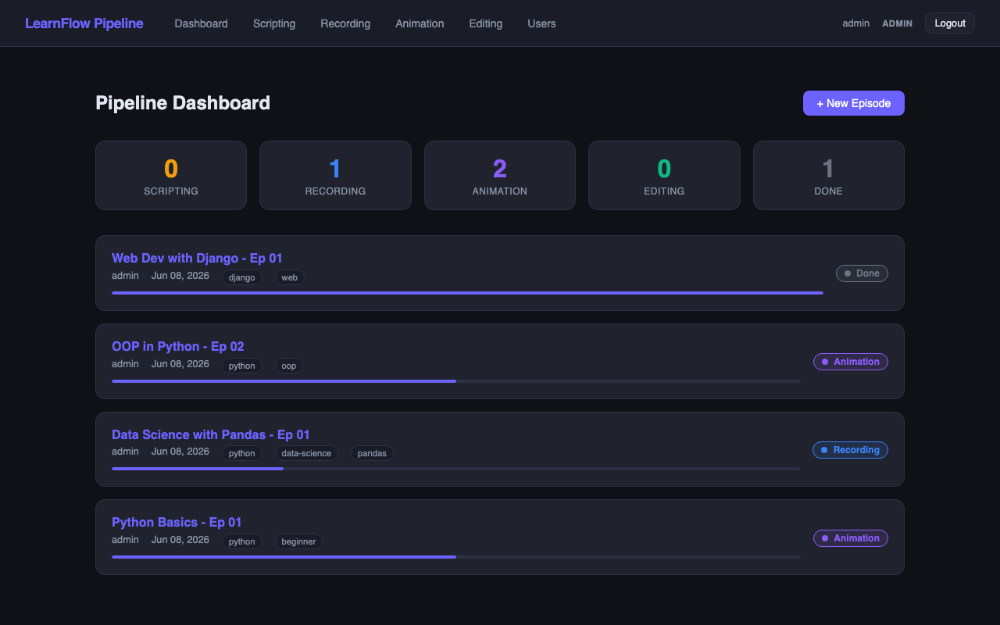
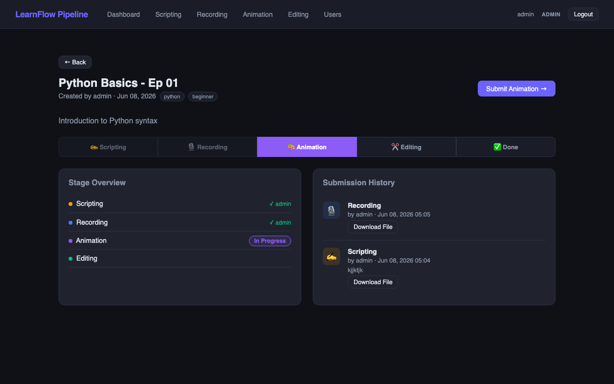
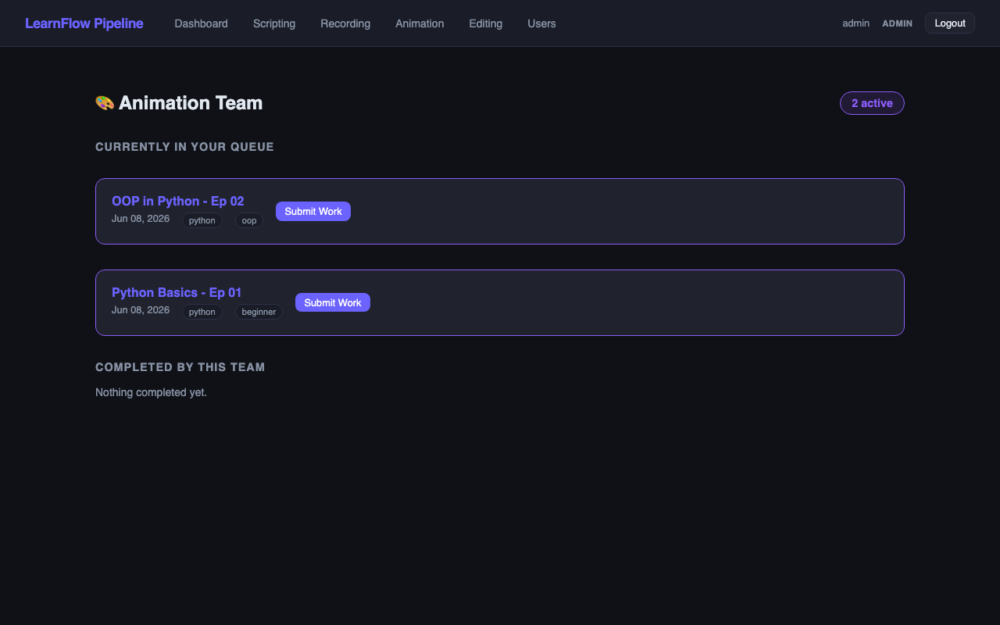

# LearnFlow Pipeline

A Django-based content production management tool that tracks educational video episodes through a multi-stage team workflow.

## What It Does

Each episode moves through 4 sequential production stages:

**Scripting → Recording → Animation → Editing → Done**

Team members are assigned to a department and can only submit work when it's their team's turn. Once they upload a file and notes, the episode automatically advances to the next stage. Admins can manage users and override any stage.

## Tech Stack

| Layer | Technology |
|---|---|
| Backend | Python, Django 4.2 |
| Database | SQLite (via Django ORM) |
| Auth | Django built-in (session-based) |
| Frontend | Django Templates + Custom CSS |
| File Storage | Local filesystem (`FileField`) |

## Project Structure

```
learning_pipeline/
├── learning_pipeline/      # Project config (settings, urls, wsgi)
├── pipeline/               # Main app
│   ├── models.py           # Episode, StageSubmission, UserProfile
│   ├── views.py            # Business logic & permission checks
│   ├── forms.py            # Django forms
│   ├── urls.py             # URL routing
│   ├── templates/          # HTML templates
│   └── migrations/         # DB migrations
├── static/css/             # Custom CSS
├── media/                  # Uploaded files (gitignored)
├── manage.py
└── db.sqlite3
```

## Architecture

Follows Django's **MVT (Model–View–Template)** pattern:

- **Models** — `Episode` tracks the content and its current stage. `StageSubmission` records every submission (file + notes + who submitted). `UserProfile` extends Django's User with a `team` field.
- **Views** — Handle permission checks (`user.profile.team == episode.current_stage`), form processing, and stage advancement logic.
- **Templates** — Server-side rendered HTML with a dark-themed custom CSS UI.

## Setup & Run

```bash
# Clone the repo
git clone <repo-url>
cd learning_pipeline

# Create and activate a virtual environment
python -m venv venv
source venv/bin/activate  # Windows: venv\Scripts\activate

# Install dependencies
pip install django

# Apply migrations
python manage.py migrate

# Create a superuser (admin)
python manage.py createsuperuser

# Run the development server
python manage.py runserver
```

Open `http://127.0.0.1:8000` in your browser.

## User Roles

| Team | Can submit at stage |
|---|---|
| `scripting` | Scripting |
| `recording` | Recording |
| `animation` | Animation |
| `editing` | Editing |
| `admin` | Any stage |

Admins can assign or change team roles via the Users panel in the nav.

## How a Stage Submission Works

1. A team member opens an episode at their current stage
2. They upload a file and add notes for the next team
3. On submit — a `StageSubmission` record is saved and the episode's `current_stage` advances automatically
4. The next team now sees the episode in their queue

## Screenshots

### Login


### Dashboard


### Episode Detail


### Team View


## License

MIT
